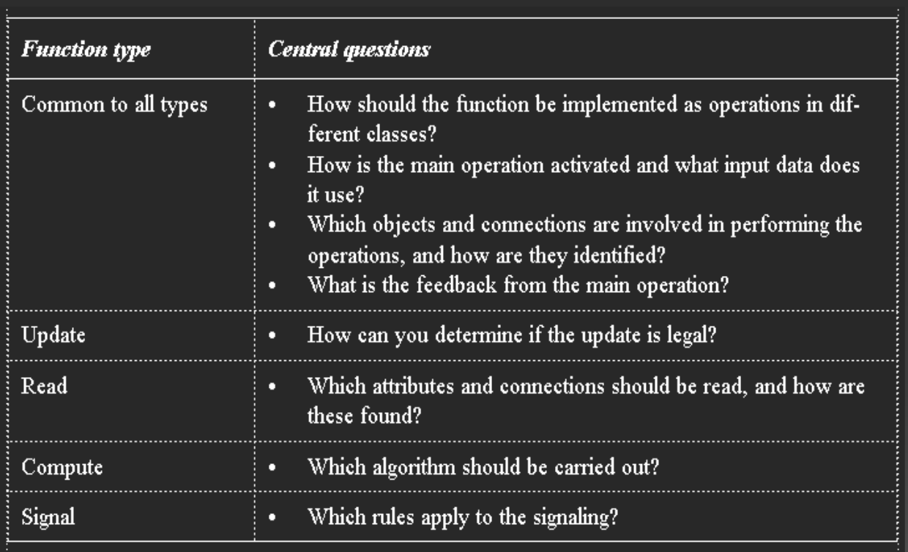

# OOA&D, section 13.6, exercise 1 (page 271).
What is the responsibility of the function component?

> Make the moddel component available as a resource to actors ...and handle updates from the problem domain.

# OOA&D, section 13.6, exercise 4-7 (page 271).
- What considerations are involved in implementing update functions?
- What considerations are involved in implementing read functions?
- What considerations are involved in implementing compute functions?
- What considerations are involved in implementing signal functions?

# OOA&D, section 13.6, exercise 8 and 9 (page 271).
- When are operations placed on classes in the model component?
- When are operations placed on classes in the function component?

As far as i can tell they are in the function component when the function involves more than one object, otherwise we can just aggregate the function from the single class that it involves.
