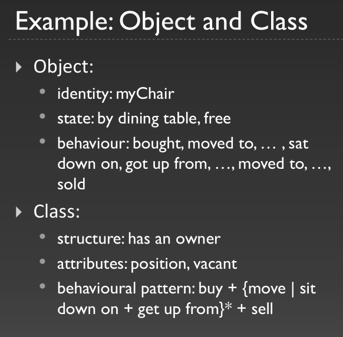
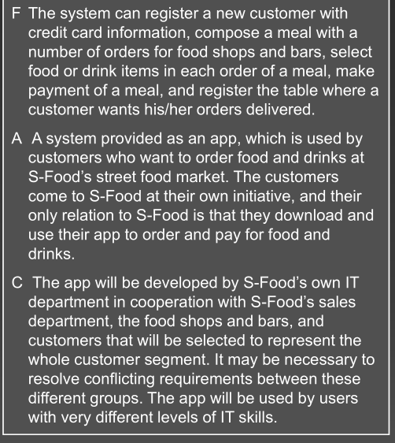
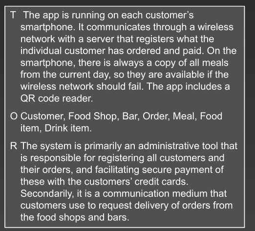
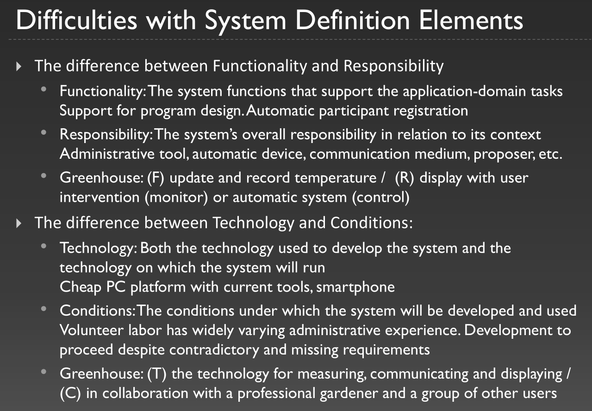

# OOA&D, section 1.9, exercise 1.
Whet is the difference bteween objects and classes?

**Object:** An entity with identity, state and behaviour.

**Class:** A description of a collection of objects sharing: structure, behavioural pattern, and attributes.



# OOA&D, section 1.9, exercise 4.
Why should systems developers understand the context of the systems they are designing?

We to get a good understanding of the context such that we can defined the problem domain and application domain properly.

# OOA&D, section 1.9, exercise 5, give examples.
How can you distinguish between a system's problem domain and application domain? Can they partly overlap?

> Problem domain: That part of a context that is administrated, monitored or controlled by a system.
> Application domain: The organization that administrates, monitors, or controls a problem domain.

Yes they can partly overlap. An example would be the in the exam project where we keep track of employees using their login, but they are also the ones using the system and keeping track of gift-baskets.

# OOA&D, section 2.10, exercise 2.
What is a system definition and how is it used?

> A concise description of a computerized system expressed in natural languages

You can think of it as a mission statement. It is the system that your are going to build, of course this is going to get updated throughout the process.

# OOA&D, section 2.10, exercise 9.
What are the elements in the FACTOR criterion

> Functionality: The system functions that support the application domain tasks.

> Application domain: Both the parts of an organization that administrate, monitor, or control a problem domain; an the users and their work tasks.

> Conditions: The conditions under which the system will be developed and used.

> Technology: Both the technology used to develop the system and the technology on which the system will run.

> Objects: The main objects in the problem domain.

> Responsibility: The system's overall responsibility in relation to its context.





# 1
Aalborg Taxi want a new system for administering and monitoring their taxis, drivers, customers and taxi rides. Describe in text the problem domain and application domain of such a system.

The problem domain will every object that they want to monitor, thus it is the taxis, drivers and customers.

The application domain will then be Aalborg taxi, and probably also either the taxi or the driver to track taxi rides.

# 2
Are the taxis, drivers, customers and taxi rides in the application domain, the problem domain or both? Why?

Previous question answers this.

# 3
Make a system definition for the Taxi System. The system definition must comply with the FACTOR-criterion.

Without more context it is a little hard, so i am just making stuff up.

# 4
Make a radically different system definition for the Taxi System. The system definition must comply with the FACTOR-criterion. Compare with the first one; what are the differences.

# 5
Start Visual Paradigm for UML (VP-UML). Create a Class Diagram that reproduces Figure 1.3 in the OOA&D book. Experiment with the tool.

```plantuml
class Person
class EmployeeRole
class CustomerRole

Person "1" *-- "1..*" EmployeeRole
Person "1" *-- "1..*" CustomerRole
```
### Extra from the lecture 2

