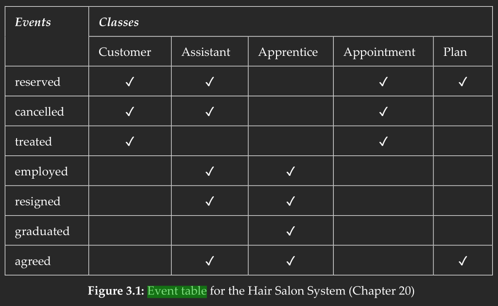

# Individual Exercises

## Section 3.6, exercise 4
**What is a common event?**

A common event is an event involving two or more objects. To take an example from the book:

> The house looked nice after Bob painted it.

There are two objects, the house and bob, and a common event painting it.

## Section 3.6, exercise 9
**What are the basic criteria for selecting classes and events?**

For classes:
- Can you identify objects from the class?
- Does the class contain unique information?
- Does the class encompass multiple objects?
- Does the class have a suitable and manageable number of events?

For events:
- Is the event instantaneous?
- Is the event atomic? (we do not want an event that encompasses multiple parts)
- Can the event be identified when it happens?

## Section 3.6, exercise 10
**What is the result of a class activity?**

The result is an event table such as the one seen below.

## Section 3.6, exercise 15
**Teaching administration**. Consider a system for a simple mobile phone. The phone can receive calls and call other phone numbers. It offers its owner a personal phone book to store names and phone numbers. The phone book can be dynamically update. The phone also manages a complete log of all incoming and outgoing calls and helps its owner to remember unanswered calls.

Add details and assumptions as needed and address the following problem. List class candidates in the mobile phone system. List event candidates in the mobile phone system. Evaluate the candidates systematically and produce the resulting event table.

Possible classes are:
- Phone book
- Calling log
- Phone
- Incoming call
- Outgoing call
- Call

Possible events are:
- Being called
- Calling someone
- Insert
- Delete
- Timeout
- Answered
- Unanswered

|                 | Phone book | Calling log | Call | Phone |
| --------------- | :--------: | :---------: | :--: | :---: |
| Being Called    |            |             | x    | x     |
| Calling someone |            |             | x    | x     |
| Insert          | x          | x           |      |       |
| Delete          | x          | x           |      |       |
| Timeout         |            |             | x    | x     |
| Answered        |            |             | x    |       |
| Unanswered      |            |             | x    |       |

Should probably have different names for insert and delete for the calling log, because the phone book and the calling log are definitely two different things, that are both important classes.

