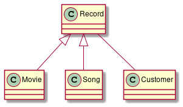

# 1.
Section 4.8, exercise 3

**Why is multiplicity only specified on object structures?**

Probably because it make much sense to put it in classes.

# 2.
Section 4.8, exercise 5

**What is the meaning of inheritance? How is it described?**

The meaning of inheritance is abstraction and structure. There is no reason to describe the same properties in two different classes if they can be related to eachother through a super-class.

# 3.
Section 3.6, exercise 14 and Section 4.8, exercise 16

Did exercise 3.6.14 on accident last lecture.

**Mobile phone. Continue your considerations of the system for a simple mobile phone  (see Exercise 3.14). Describe structural relations between classes and objects in a class  diagram.**

There is definitely some argration between the phone and some of the other classes. Seeing as a calling log is a part of a phone, and an address book is a part of a phone. An address book and a calling log can also both been seen a type of record. There is also a phone and a call, and a calling log and a call.

# 4.
Make a class diagram for the taxi system introduced in lecture 1. Choose one of the system definitions you made and use it to select classes. Make a class diagram with these classes.

# 5.
Make a class diagram for a system for a streaming service with the following system definition:

- F: register the movies the customers see and the songs they listen to, and support payment by customers for their consumption of movies and songs.
- A: will be used by the administrative personnel that is employed by the organization that provides the streaming service.
- C: developed for the administrative personnel.
- T: PC platform with typical tools.
- O: Customer, Movie, Song.
- R: registration, administration and payment of customers’ consumption.

# 7.
Start on Hand in assignment 1.
