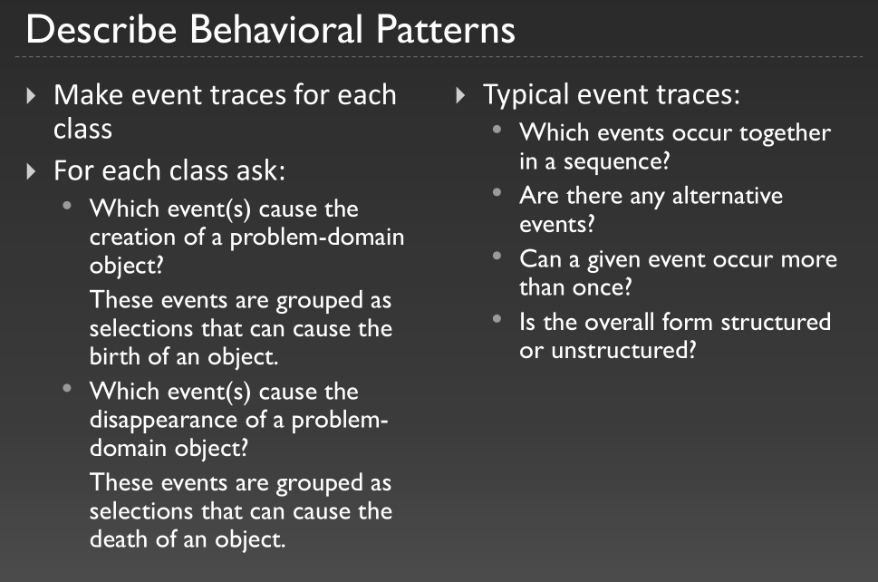

# OOA&D, section 5.9, exercise 2 (page 114).
What is an event trace?

An event trace is all the events that have happened to a specific object.

# OOA&D, section 5.9, exercise 3 (page 114).
What is a behavioural pattern?

> A description of possible event traces for all objects in a class

# OOA&D, section 5.9, exercise 9 (page 114).
How are behavioural patterns developed and described?

Check section 5.3 in book for more info.

# OOA&D, section 5.9, exercise 20 (page 114).
Mobile phone: Continue your considerations of the sytem fo a simple mobile phone. Describe the behavioural patterns and attributes of selected key classes.
