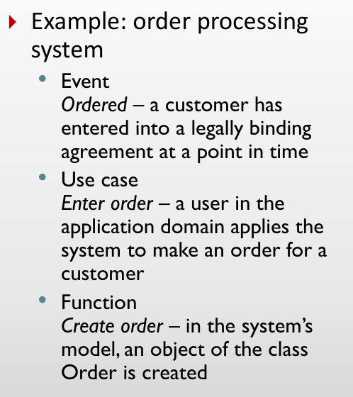
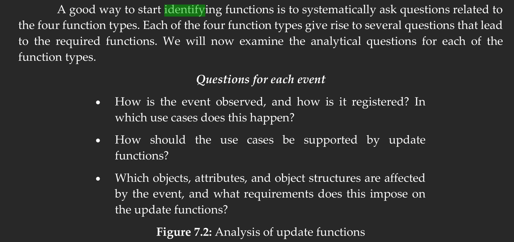
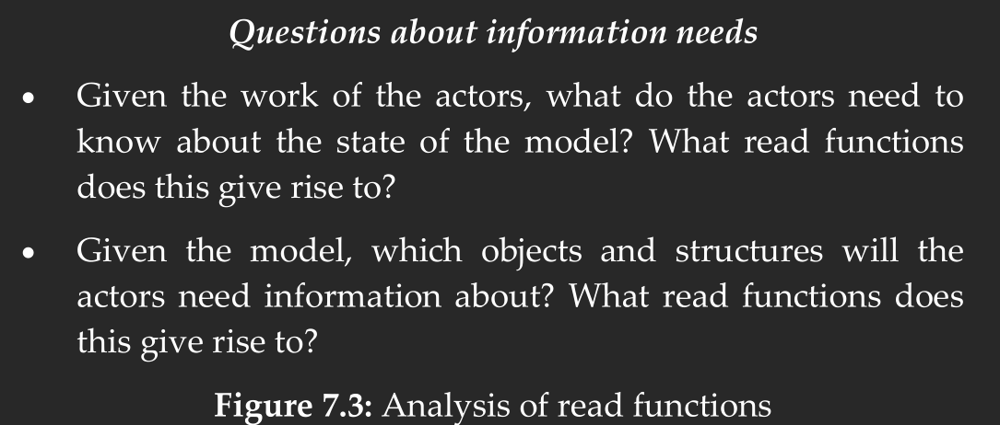
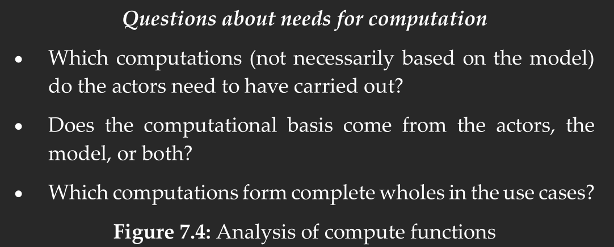
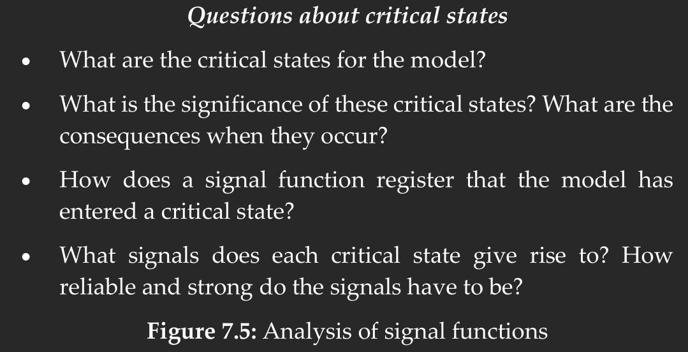

# Section 7.6, exercise 2
What is the difference between a function and a use case?

A use case is something an actor or another system does to interact with our system. While a function is something our model does to change itself.

**Example:**

# Section 7.6, exercise 3
What are the four different function types?

- Update
- Compute
- Read
- Signal

# Section 7.6, exercise 5
Which sources are used to identify functions?

# Section 7.6, exercise 7
How can the functional requirements be evaluated?

# Section 7.6, exercise 12
