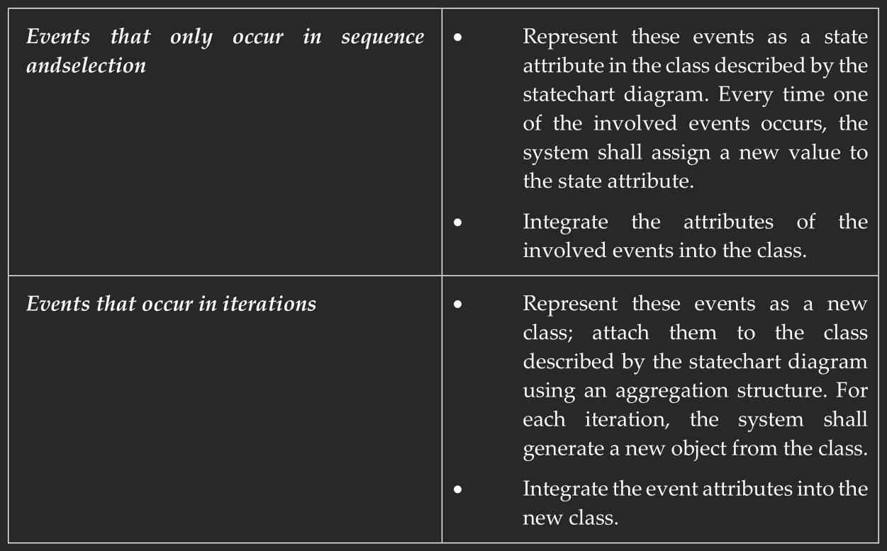

# OOA&D, exercise 12.2 (page 250).
Why are private and common events represented differently?

A private event only occurs for a single object, which makes it simple to represent as only that object needs direct access to it. However, a common event involves multiple objects which both need acces to the event "data", thus things get more complicated when we want to represent this event.

# OOA&D, exercise 12.3 (page 250).
How are private events represented?

# OOA&D, exercise 12.4 (page 250).
How are common events represented?

